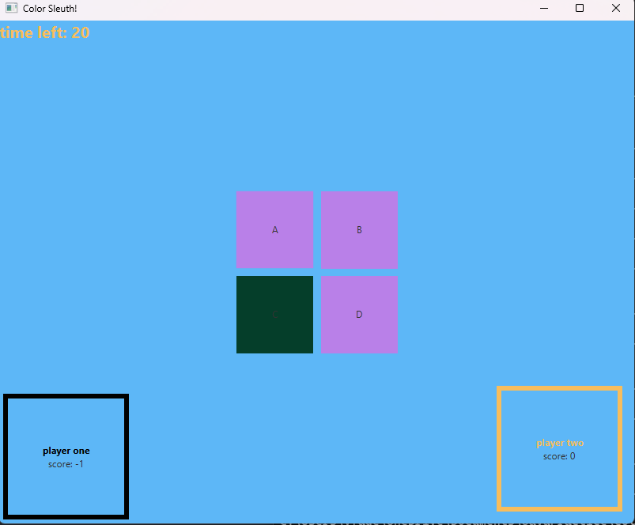

# COLOR SLEUTH 
A simple game I made to learn more java and learn javafx, probably not the most efficiently programmed application.. but it works.
Also a template for future javafx projects.



# How to play
 1. ```java -jar build/ColorSleuth.jar``` or build your own jar file to run.
 2. after ran, the game will immediately start. There is no start screen.
 3. The game alternates between player one and player two.
 4. Click the button with the different color to gain a point.
 5. Clicking the wrong button will result in the loss of a point.
 6. If a player runs out of time they will lose a point and it will be the next players turn. 
 7. If one player falls more than 3 points short of the other, they lose and the other player wins.
 8. If a player gets below -3 points they lose. 
 9. The colors get progressively harder to discern between as the game goes on.
 10. every 5 (+ or -) points the game gets harder.

# How to build (Fat build)
 1. ```set PROJECT_DIR=C:/full/path/to/the/dir/this/is/in``` (or export PROJECT_DIR in linux)
 2. ```.\package.sh```
 3. ```.\run32.sh``` for linux ARM x32 support, ```run.sh``` for everything else.
 4. .JAR artifact(s) will be in /build

# Supported Os & Architectures
 1. Windows x64
 2. Linux aarch64
 3. Arm32 Linux (seperate artifact)
 4. MacOS (OSX) aarch64

# Arm32 Linux build
 Arm32 Linux builds require a different jar.
 